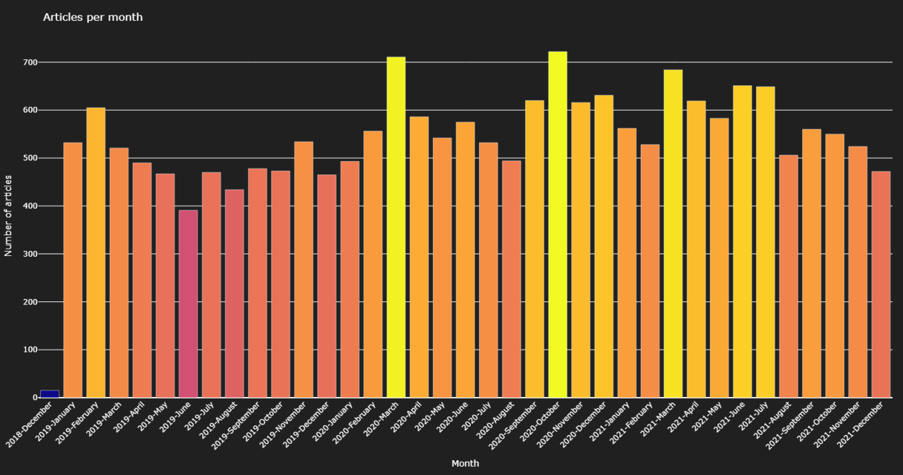
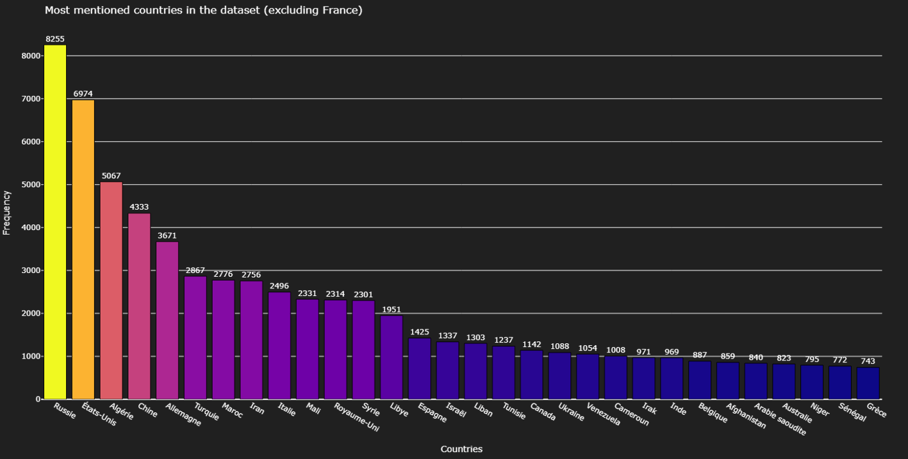
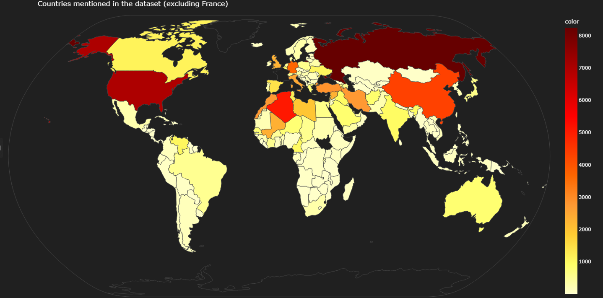
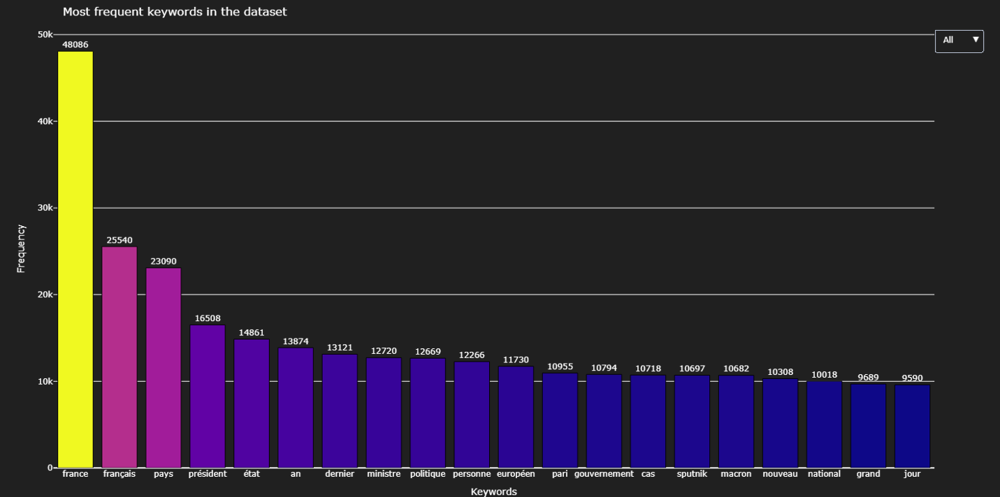
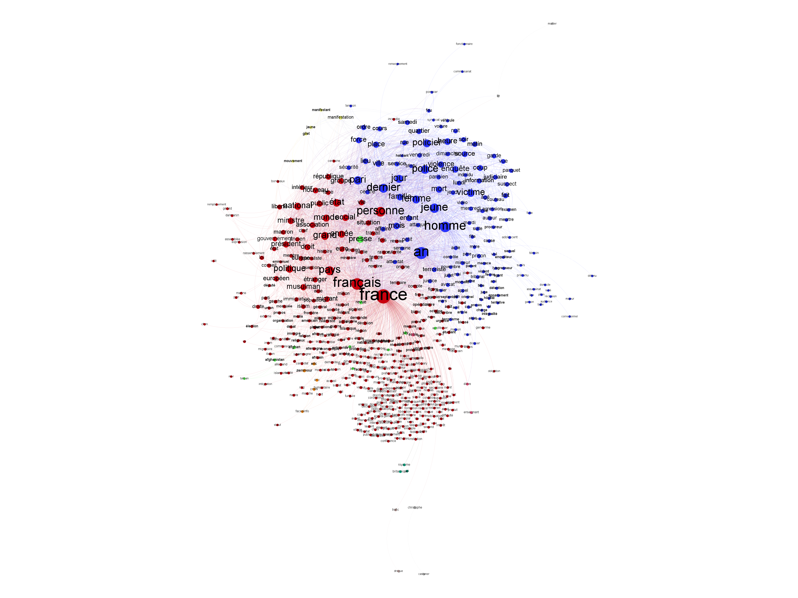
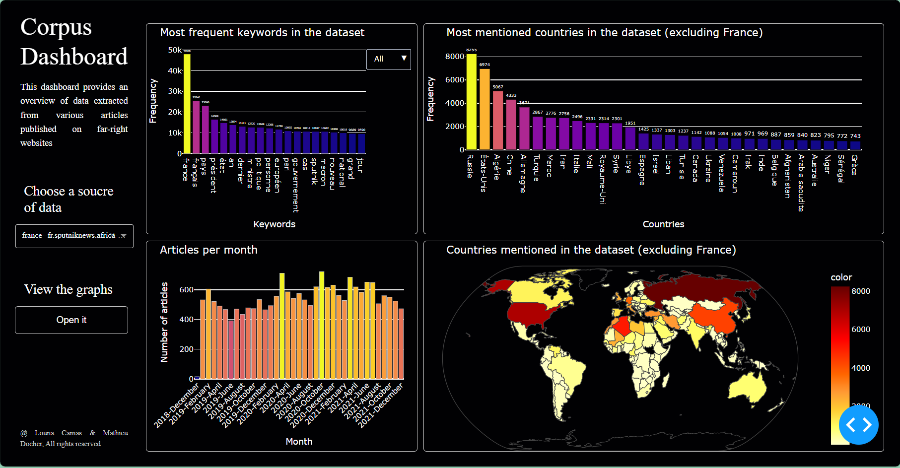

# **Projet DATA732 - Analyse d'articles**

*Par : Louna Camas et Mathieu Docher*

*Données utilisées : Corpus d'articles d'extrême droite* 

---

## Introduction 

Au cours de ce projet, nous avons créer des visualisations afin d'analyser des données extraites d'articles de journaux d'extrème droite. L'objectif étant de produire un dashboard clair et cohérent permettant l'analyse des données.

### Technologies utilisées
Ce projet a été entièrement codé en python à l'aide des librairies suivantes :
- `Json` : lecture et récupération des données
- `Plotly.graph_objects` & `Plotly.express` : réalisation des différents graphiques
- `Dash` : réalisation du dashboard
- `Flask` : utilisation de fichiers html des graphes de manière dynamique
- `Calendar` & `Datetime` : gestion des dates de publication
- `Networkx` : création de graphe
- `ForceAtlas2` : amélioration la disposition des noeuds
- `Community` : créer des communautés/ de la modularité

Les graphes ont été visualisés à l'aide du logiciel `Gephy`.

## Réalisations

### Nombre d'articles par mois

Une des premières choses qui nous est apparu pertinente de représenter est le nombre d'articles publiés par mois afin de voir si des tendances apparaissent. Nous avons choisi un diagramme en barres car il permet de bien visualiser l'évolution des données dans le temps. Une barre correspondant à un mois est le meilleur compromis entre lisibilité et précision des données.

Le premier point différent est le nombre d'articles publié en décembre. Il est très inférieur à ceux des autres mois. Cela s'explique facilement en observant la plage des données recueillies qui est censée commencer le 1er janvier mais qui contient sûrement quelques articles de la fin décembre.
Par la suite, nous pouvons remarquer, quasiement systématiquement, des creux durant la période éstivale. Moins de gens travaillent donc moins d'articles.
De manière globale, le nombre moyen d'articles publiés augmente légèrement avec des piques en mars 2020 (peut-être du au covid19) et en octobre 2020.

 

### Citations de noms de pays

Nous avons ensuite décidé de représenter le nombre d'apparitions de noms de pays dans les articles. Pour cela, nous avons choisi de faire un histogramme, car il permet de visualiser rapidement les 30 pays les plus cités par chaque média, et une carte du monde pour rendre le tout plus visuel et éventuellement repérer certaines _tendances_ géographiques ou politiques.

Pour ce faire, nous cherchons dans chaque article publié sur le site les noms de pays et les stockons dans un dictionnaire avec leur nombre d'apparitions. Ensuite, nous sélectionnons les 30 pays les plus cités et les représentons dans l'histogramme, en excluant certains pays trop cités (comme la France ou la Mali (dans les corpus concernant le Mali)). Par exemple, voici l'histogramme obtenu pour toutes les citations de noms de pays dans les articles de Sputniknews, entre 2019 et 2022. 

On peut voir que les pays les plus cités sont la Russie, les États-Unis et l'Algérie avec respectivement 8255, 6974 et 5067 mentions sur près de 14000 articles. Simplement avec ces informations, on peut déjà se faire une idée des sujets les plus abordés par Sputniknews.

Ensuite, nous avons utilisé la librairie `plotly` pour créer une carte du monde avec les pays les plus cités. Les pays sont colorés en fonction du nombre de citations, ce qui permet de voir rapidement les pays les plus cités _(oui, normalement si on colore l'entièreté de la surface du pays, c'est pour indiquer une densité, mais ici, on a choisi de le faire pour des raisons de lisibilité, désolé)_. Voici la carte obtenue, toujours pour Sputniknews :

On remarque très facilement les pays les plus cités, mais on peut voir plus facilement certaines tendances géographiques, notamment envers les pays du Moyen-Orient et d'Afrique du Nord, qui sont assez souvent cités dans les articles de Sputniknews. La carte ajoute donc une dimension visuelle et géographique que l'histogramme ne permet pas.

### Fréquence des mots clés

Le choix d'un graphique en barres s'explique ici par sa représentation claire de la fréquence des mots-clés dans le corpus d'articles. Il permet de comparer facilement les occurrences des termes les plus utilisés, en mettant en évidence les différences et les tendances dans les données en fonction des années. En effet, pour créer ce graphique, nous parcourons toutes les données en sauvegardant dans un dictionnaire le nombre d'apparition des mots par année et au total. Ensuite, nous sélectionnons uniquement les 20 termes apparaissant le plus (par soucis de lisibilité). Nous pouvons choisir l'année à l'aide du menu déroulant sur la droite du graphique.

Grâce à cette représentation,nous pouvons voir que les mots `France`, `Français`et `Pays` apparaissent majoritairement, ce qui semble logique pour des journaux d'extrème droite. Nous observons également des "thèmes" par année, ce qui rend possible de déterminer des évènements marquants de l'année. Comme par exemple en 2019 avec la crise des gilets jaunes et l'augmentation de la fréquence de `jaune`, `gilet` et `macron` ou encore des évènements avec la police en 2021 (`police`, `policier`).

 

### Graphes
Le dernier type de visualisation que nous avons choisi de réaliser est un graphe. Nous avons choisi de représenter les liens entre les mots-clés les plus fréquents des articles. Pour cela, nous avons utilisé la librairie `networkx` qui permet de créer des graphes. Nous avons choisi de faire un graphe non orienté, car les liens entre les mots-clés ne sont pas forcément à sens unique. Concrètement, chaque mot-clé apparaissant dans un article forme des couples avec l'ensemble des autres mots-clés de l'article. Pour chaque article du corpus, l'ensemble des couples ayant un nombre minimum d'occurrences est ajouté au graphe, sous forme d'un lien entre les deux mots-clés. Ainsi, on peut réduire la taille du graphe obtenu en ne gardant que les liens les plus fréquents.

Dans un second temps, nous avons essayé d'améliorer la visibilité des graphes obtenus de deux manières :

- En utilisant les bibliothèques `fa2` (ForceAtlas2) et `community` pour améliorer la disposition des noeuds et les regrouper en communautés. Le graphe est ensuite mis en forme et affiché par la bibliothèque `plotly`. Cependant, nous ne sommes pas parvenu à des graphes très satisfaisants, les noeuds sont souvent trop proches les uns des autres, les communautés ne sont pas très claires et le tout est difficilement lisible. Le point positif de cette méthode est qu'elle permet d'avoir un graphe interactif au format html, sur lequel on peut zoomer par exemple. Voici un exemple de graphe obtenu avec cette méthode :

- En éditant le graphe manuellement sur Gephi, un logiciel de visualisation de graphes. Gephi permet de manipuler les noeuds et les liens du graphe de manière plus précise, en les déplaçant, en les regroupant, en changeant leur taille, leur couleur, etc. On peut également calculer des mesures de centralité, de modularité, etc. pour mieux comprendre la structure du graphe. Cependant, Gephi ne permet pas de créer des graphes interactifs, il faut donc exporter le graphe en image ou en pdf pour le visualiser. Voici un exemple de graphe obtenu avec Gephi et les URL pour télécharger les images en haute résolution :

_([Graphe n°1 : "françaisdesouche"](pictures/graph_gephi_fdesouche.png))_
_([Graphe n°2 : "égalité et reconciliation"](pictures/graph_gephi_egalitereconcil.png))_

## Dashboard
Pour construire le dashboard, nous avons utlisé *dash*. Ce dernier a connu deux versions distinctes. Une première version "simple" contenant une div comportant un titre et un unqiue espace pour un graphique. Les différents graphiques étaient organisés à l'aide de *subplot*. Cependant, cettte réalisation comporte de nombreuses limites telles que les titres et les légendes (colorscale) n'apparaissaient pas enlevant la possibilité qu'ils se mettent à jour avec le graphique, et également l'esthétisme. Il est assez dur de modeler *subplot* selon le résultat que nous voulions.
Une seconde version (la finale) a suivi optimisée à l'aide de *dash* uniquement. Le dashboard a été agencé comme une page html avec des containers, des divs à foison, un fichier css... Cela nous a permis de vraiment le personnaliser.

Le dashboard est composé :

- d'une **barre latérale** à gauche, présentant notre travail et permettant de choisir la source de donnée grâce au menu déroulant. Nous y retrouvons aussi un bouton donnant accès à une page web pour visualiser et intéragir avec le graphe correspondant aux données choisies dans le menu déroulant. 
Nous n'avons pas voulu incorporer directment le graphe dans la première page du dashboard en raison des ressources que sa visualisation consomme. En effet, la génération du dashboard prend déjà un certain moment, le temps de générer tous les graphes, si en plus nous rajoutions la génération du graphe, le temps d'attente serait très élévé. De plus, certains ordinateurs ont beaucoup de mal à générer les graphes, ce qui empècherait juste des utilisateurs de visualiser le dashboard.

- d'une **zone contenant les graphiques**. Nous avons essayé d'adapter les tailles des graphiques afin d'optimiser la lisibilité des plus compliqués. La fréquence des mots clés aurait peut-être mérité une plus grande place mais nous ne voulions pas séparer les deux graphiques relatifs aux pays.

 